<div align="center">

# Gahezlak · جهزلك

**QR-code menus and contactless ordering for restaurants.**

Diners scan a code at the table, browse a bilingual menu on their phone, and pay by card, mobile wallet or cash.
Restaurants get a dashboard for menus, staff, live orders and analytics — on a subscription platform that bills itself.

[](https://github.com/SaraAboElenien/gahezlak-v2/actions/workflows/ci.yml)


</div>

---

## Screenshots

<div align="center">

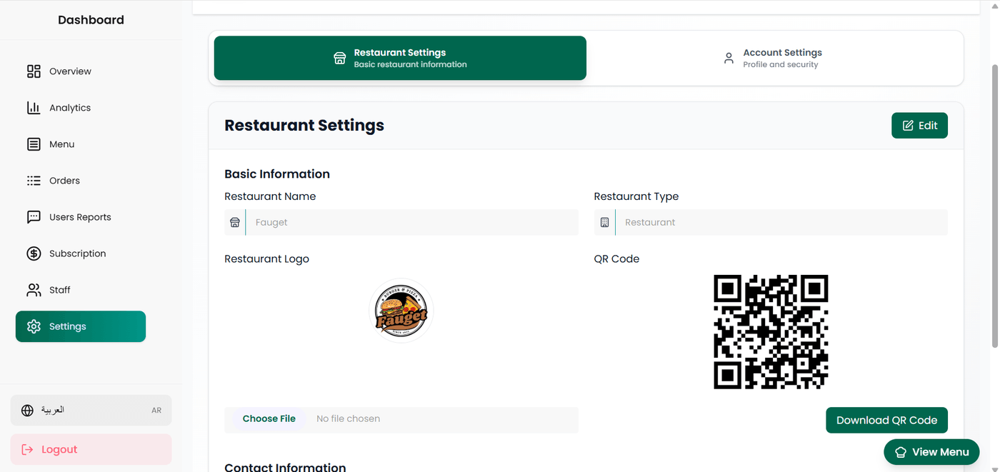

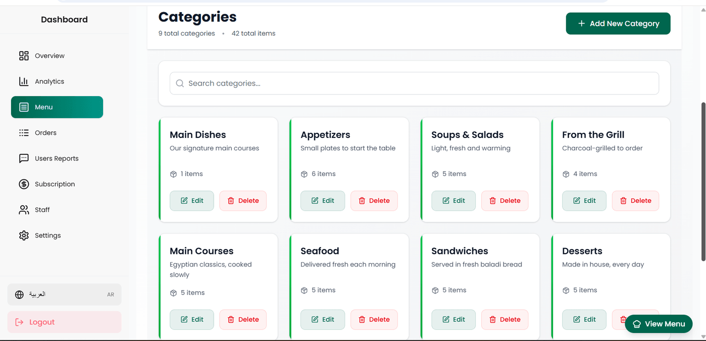

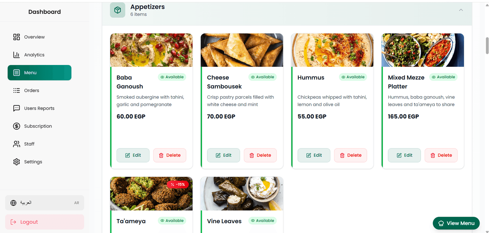

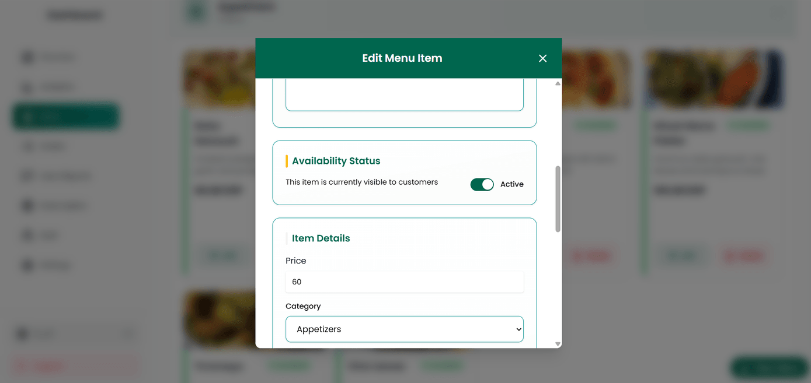

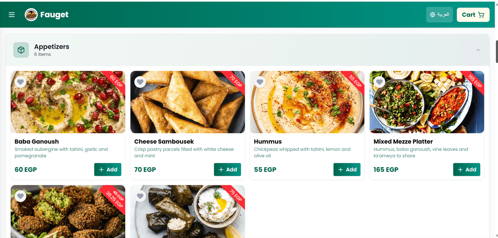

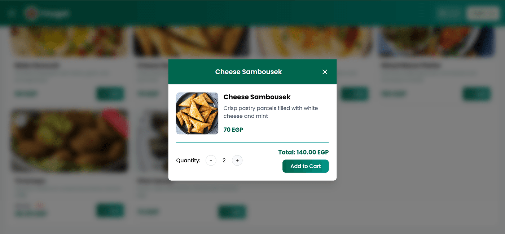

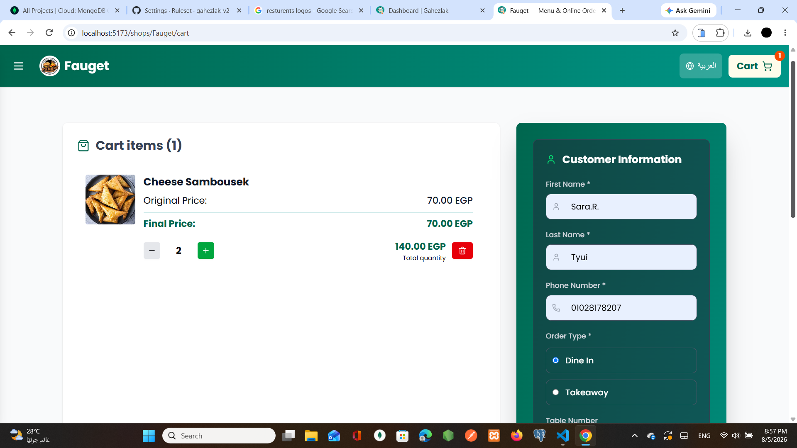

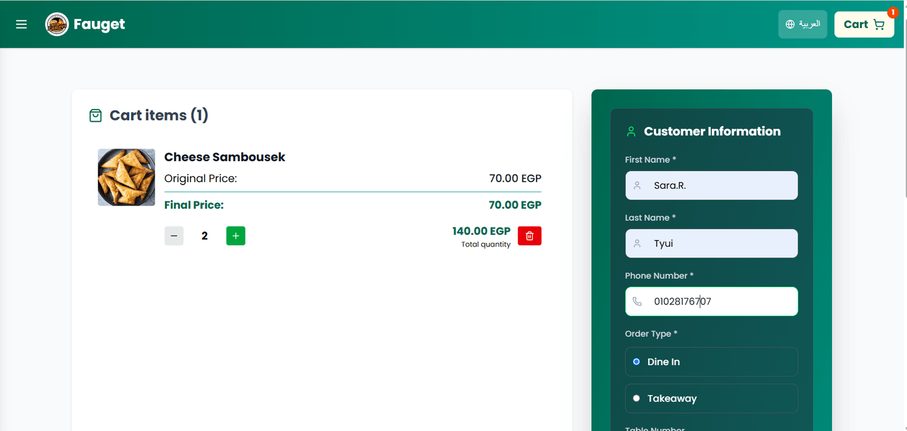

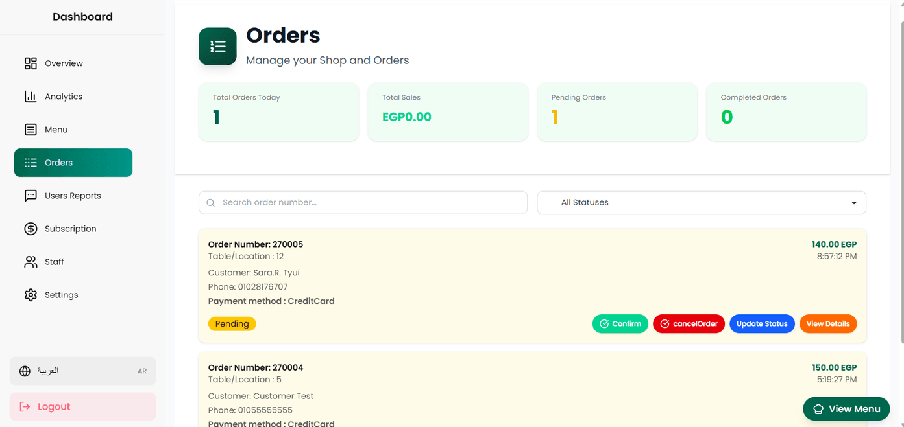

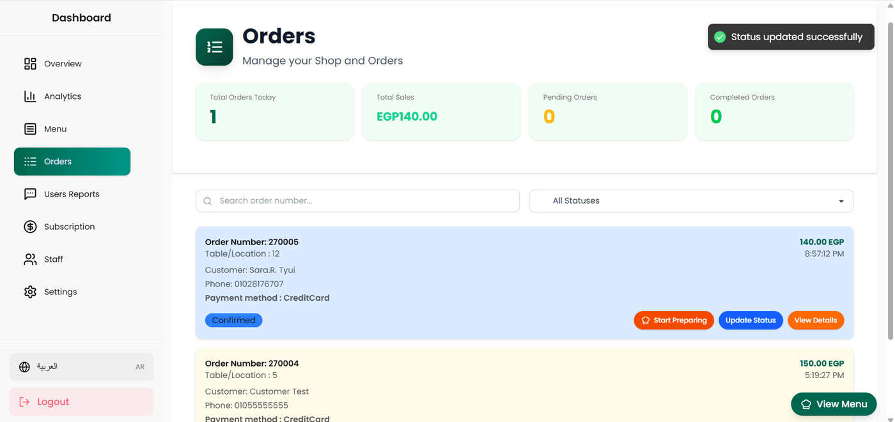


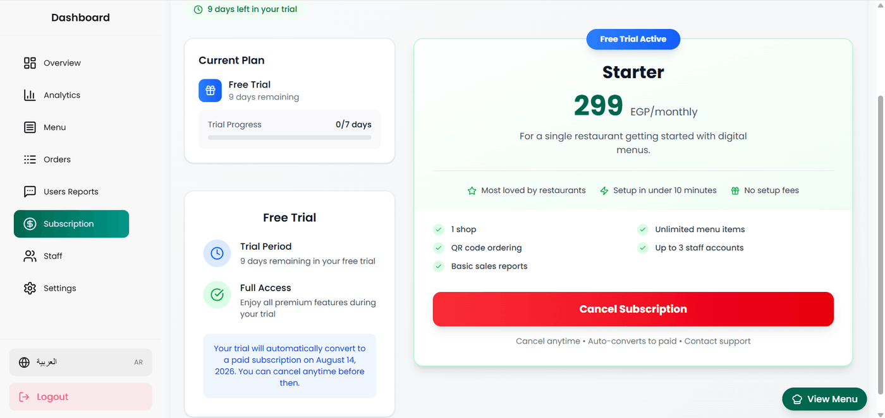

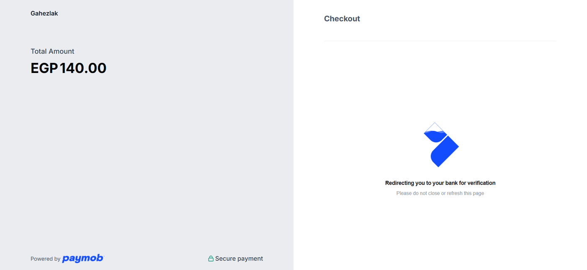

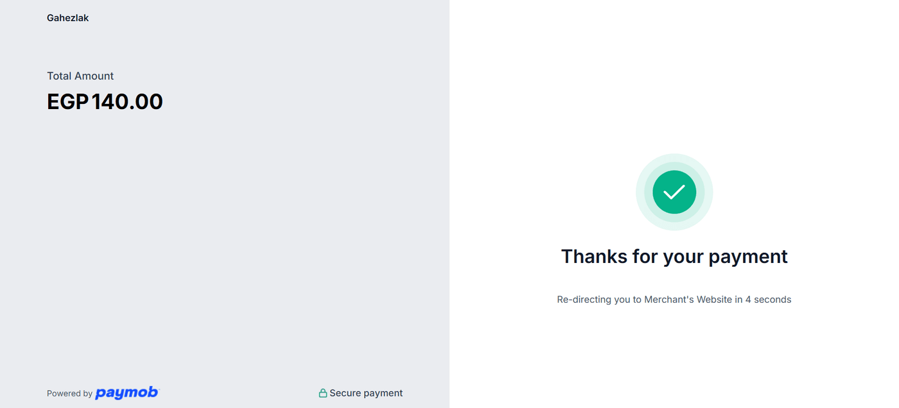


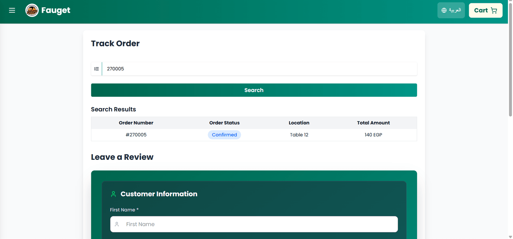

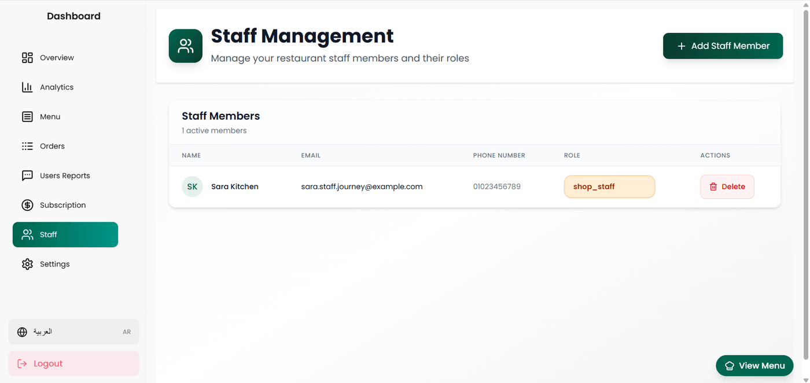

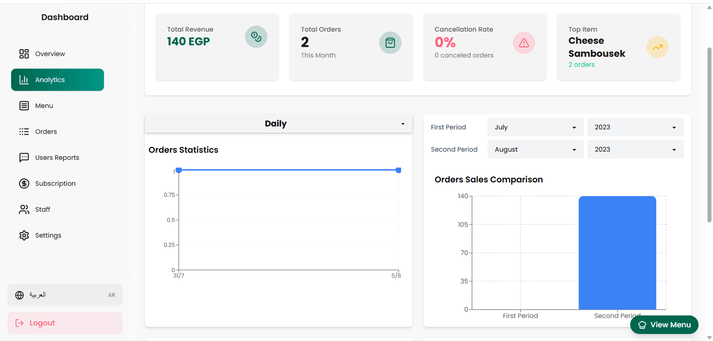

</div>

> Every screen is fully bilingual — the العربية toggle flips the entire interface to right-to-left, not just the copy.

---

## What it does

**For diners** — no app to install. Scan the QR code on the table and the menu opens in the browser: photos, prices, per-item options, live availability, and dietary information. Order and pay from the phone, or choose to pay the restaurant in person.

**For restaurants** — a dashboard to build the menu (categories, options, discounts, availability), print QR codes, watch orders arrive and move them through a validated status workflow, invite staff with scoped roles, and read revenue and volume analytics.

**For the platform** — restaurants subscribe on monthly or yearly plans with free trials. Billing, renewals, cancellations and suspensions are handled through Paymob's recurring-payment API and reconciled by signed webhooks.

---

## Architecture

Two independently deployed services. The frontend is a **web service rather than a static bucket** on purpose — its Express layer rewrites `<head>` per restaurant at request time so link previews and search engines see real per-shop metadata, which no static host can do.

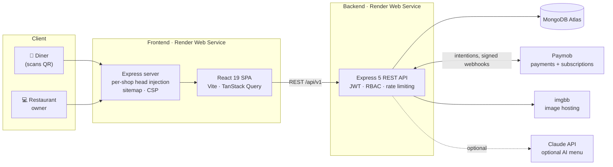

**Request-path security**, in the order a request meets it: Helmet → CORS allowlist that *rejects* unknown origins rather than merely omitting headers → MongoDB-backed rate limiter → JWT verification → role authorisation → resource-ownership check → schema validation → handler.

---

## Engineering highlights

The parts worth reading the source for.

<table>
<tr><td width="34%"><b>Tenant isolation by construction</b></td>
<td>Shop-scoped queries apply <code>shopId</code> <em>last</em>, so a caller-supplied filter cannot widen its own scope. Update endpoints copy through explicit field allowlists typed <code>as const satisfies readonly (keyof IModel)[]</code> — renaming a model field breaks the build instead of silently opening a hole, and the tests assert both directions: that an escalation is refused, and that an ordinary edit still saves.</td></tr>

<tr><td><b>Tokens that XSS cannot read</b></td>
<td>The refresh token is an <code>httpOnly</code>, path-scoped cookie; the access token lives only in a module-level variable and dies with the tab. Neither is in <code>localStorage</code>. Refresh tokens rotate on every use and are single-redemption.</td></tr>

<tr><td><b>Prices are never trusted from the client</b></td>
<td>Order totals are recomputed server-side from stored menu items, options and discounts. The client's arithmetic is ignored entirely.</td></tr>

<tr><td><b>Uniform auth responses</b></td>
<td>Login, password reset and verification give byte-identical answers whether or not an address is registered — including a dummy bcrypt comparison so the unknown-address path takes the same time. No user-enumeration oracle.</td></tr>

<tr><td><b>Webhooks verified before they touch data</b></td>
<td>HMAC-SHA512 compared with <code>crypto.timingSafeEqual</code>, with a length pre-check, before any database mutation.</td></tr>

<tr><td><b>Trials that verify without charging</b></td>
<td>A free trial's first transaction runs through a verification integration that authorises and auto-voids, so the card is proven without taking money. Renewals bill the plan's own amount, never the first transaction's.</td></tr>

<tr><td><b>Bilingual to the root</b></td>
<td>English and Arabic across UI, validation messages and API errors, with full RTL layout switching. Error messages carry both locales from the server.</td></tr>

<tr><td><b>Tested against a real database</b></td>
<td>432 tests, none skipped. The backend suite boots a real <code>mongod</code> in memory rather than mocking Mongoose — which is how it caught two defects that only exist at the driver level: <code>undefined</code> being stripped from <code>$set</code>, and <code>$match</code> not casting ObjectIds inside an aggregation.</td></tr>
</table>

---

## Tech stack

| | |
| --- | --- |
| **Backend** | Express 5 · TypeScript · Mongoose 8 · JWT + bcrypt · express-validator · Pino · Sentry |
| **Frontend** | React 19 · TypeScript · Vite · TanStack Query · React Hook Form + Zod · Tailwind + shadcn/ui · i18next · Recharts |
| **Data** | MongoDB Atlas |
| **Integrations** | Paymob (cards, wallets, subscriptions) · imgbb (images, QR codes) · Claude (optional AI menu) |
| **Testing** | Vitest · supertest · `mongodb-memory-server` · React Testing Library |
| **Ops** | Render (two web services) · GitHub Actions CI · Dependabot · Sentry with release tagging and source maps |

Node **22.x** on both sides (see `.nvmrc`).

---

## Repository layout

A monorepo of two **independent** npm packages. There is no workspace root — each has its own `node_modules`, its own lockfile, and is built and deployed on its own.

```
backend/           Express + TypeScript REST API
  ├── controllers/   HTTP layer — no business logic
  ├── services/      business logic, independently testable
  ├── models/        Mongoose schemas
  ├── middlewares/   auth, RBAC, rate limiting, subscription gating
  ├── validators/    express-validator request schemas
  └── tests/         21 files, real in-memory mongod

frontend/          React + TypeScript SPA (Vite)
  ├── src/           the application
  └── server/        Express server: per-shop <head>, sitemap, CSP

render.yaml        Deployment blueprint for both services
```

The repo root holds only shared tooling: Prettier, husky/lint-staged, and the CI workflow.

---

## Getting started

You need Node 22 and a MongoDB connection string (local `mongod` or an Atlas cluster).

```bash
git clone https://github.com/SaraAboElenien/gahezlak-v2.git gahezlak && cd gahezlak
```

```bash
# Terminal 1 — API on :3000
cd backend
npm ci
cp .env.example .env       # then fill it in — see below
npm run seed:roles:dev     # required: registration fails without the roles collection
npm run dev
```

```bash
# Terminal 2 — web on :5173
cd frontend
npm ci
npm run dev
```

Open **http://localhost:5173**. Check the API with `GET /health` → `{"status":"ok","db":"connected"}`.

### Configuration

`backend/.env.example` documents every variable the API reads, what breaks when it is missing, and which are genuinely optional. The short version: `MONGODB_URI`, `JWT_SECRET` and `FRONTEND_URL` are required and the server refuses to start without them. Everything else degrades one feature rather than blocking boot — though `IMGBB_KEY` is required *in practice*, because creating a shop generates and uploads a QR code.

The frontend needs `VITE_API_URL`; in development `frontend/.env.development` already points at `http://localhost:3000/api/v1`.

```bash
cd backend
npm run seed:roles:dev     # roles — registration depends on this
npm run seed:plans:dev     # subscription plans (created on Paymob first)
```

Both seeds are idempotent and safe to re-run.

### Optional features

- **AI menu tools** — photo-to-menu OCR and allergy/diet-aware search, **off by default**. They need `ANTHROPIC_API_KEY` on the backend *and* `VITE_AI_ENABLED=true` on the frontend; setting only one gives either a UI whose requests are refused or working endpoints with no way to reach them. Enrichment runs per shop (`POST /ai/menu/enrich-all`) — until it does, dietary filters correctly treat every item as unsafe and show nothing.
- **Payments** — need a Paymob account. Each integration has one job: card/3DS for checkout, wallet for mobile wallets, MOTO for recurring subscription deductions, and a verification integration for a trial's first transaction. Cash means pay in person and never touches Paymob.

---

## Testing

```bash
cd backend  && npm test    # Vitest + supertest, real in-memory mongod
cd frontend && npm test    # Vitest + React Testing Library
```

Neither suite needs a running database or any external credentials — the backend spins up its own `mongod` and third-party APIs are mocked.

```bash
npm run lint            # in either package
npx tsc --noEmit        # backend
npx tsc -b --noEmit     # frontend (SPA, Vite config and server)
```

From the repo root, `npm run format` applies Prettier and `npm run format:check` verifies it; a husky pre-commit hook formats staged files automatically.

---

## Deployment

Both halves deploy to [Render](https://render.com) as long-running Node web services, described by `render.yaml`. Health checks: `GET /health` on the API, `GET /healthz` on the frontend.

Two things that are easy to get wrong:

- **`VITE_API_URL` must be set in the frontend's *build* environment**, not only at runtime. Vite inlines it into the bundle at build time and the server reads it again at boot to derive the CSP. Set it only at runtime and the health check passes while every API call fails.
- **If you use MongoDB Atlas, add Render's egress IPs to the access list.** A developer-machine allowlist will not cover them.

CI runs typecheck, lint, tests and a real build for both packages on every push to `main` and every pull request, and requires **no repository secrets**. There is deliberately no deploy job — Render watches this repository directly, and a second deploy path would race with it.

---

## Project status

Feature-complete and covered by tests; the payment integration runs against Paymob's sandbox. Known gaps are tracked honestly rather than hidden:

- Paid orders confirm via a Paymob webhook, which needs a publicly reachable backend — so in local development an order stays `Pending` after a successful sandbox payment.
- AI menu features are switched off pending API credits.
- No end-to-end test suite yet; the full journey has been verified by hand.

---

## License

No license has been chosen yet. Until one is added, all rights are reserved and this code is not licensed for reuse.
